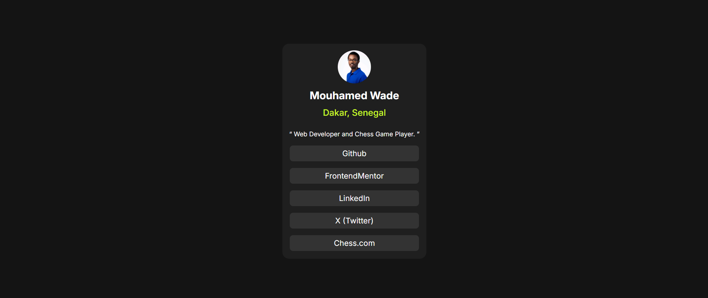

# Frontend Mentor - Social links profile solution

This is a solution to the [Social links profile challenge on Frontend Mentor](https://www.frontendmentor.io/challenges/social-links-profile-UG32l9m6dQ). Frontend Mentor challenges help you improve your coding skills by building realistic projects.

---

## Table of contents

- [Frontend Mentor - Social links profile solution](#frontend-mentor---social-links-profile-solution)
  - [Table of contents](#table-of-contents)
  - [Overview](#overview)
    - [The challenge](#the-challenge)
    - [Screenshot](#screenshot)
    - [Links](#links)
  - [Built with](#built-with)
  - [🧩 Best Practices Applied](#-best-practices-applied)
  - [✨ Notable Code Snippet](#-notable-code-snippet)
  - [📚 Key Takeaways](#-key-takeaways)
  - [Author](#author)

---

## Overview

### The challenge

Users should be able to:

- See hover and focus states for all interactive elements on the page

---

### Screenshot



---

### Links

- Live Site URL: [Social Links Profil](https://miwodi-social-links-profil.netlify.app)

## Built with

- Semantic HTML5 markup
- CSS custom properties
- Flexbox
  
---

## 🧩 Best Practices Applied

| Practice | Description |
|---------|-------------|
| `rel="noopener noreferrer"` | Prevents reverse tabnabbing and enhances security |
| Descriptive `alt` text | Improves accessibility for screen readers |
| `display: block` on `<a>` | Makes the entire `<li>` clickable without JavaScript |
| `transition` usage | Enhances hover animations |
| CSS Design Tokens | Centralized variables using `:root` for consistency |

---

## ✨ Notable Code Snippet

```css
ul li:hover a {
  color: red;
}
ul li a {
  display: block;
  width: 100%;
  text-decoration: none;
  color: var(--White);
  transition: color 0.3s ease;
}
```

> This allows the link inside a list item to change color when the user hovers over the entire li, improving usability and feedback.

---

## 📚 Key Takeaways

- hover doesn’t cascade to children unless explicitly targeted (li:hover a)

- display: block on `<a>` expands the clickable area

- Even small projects benefit from mobile responsiveness

- Accessibility (contrast, focus, readable structure) is non-negotiable

---

## Author

- Github - [LaudeDignus](https://www.github.com/LaudeDignus)
- Frontend Mentor - [@LaudeDignus](https://www.frontendmentor.io/profile/LaudeDignus)
- Twitter - [@laude_dignus_01](https://www.twitter.com/Laude_Dignus_01)
